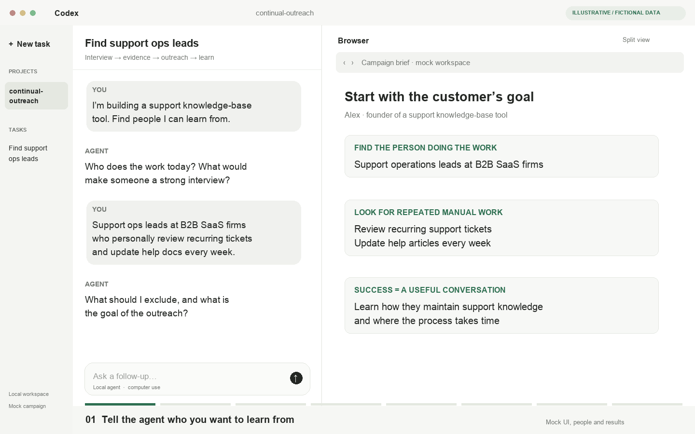
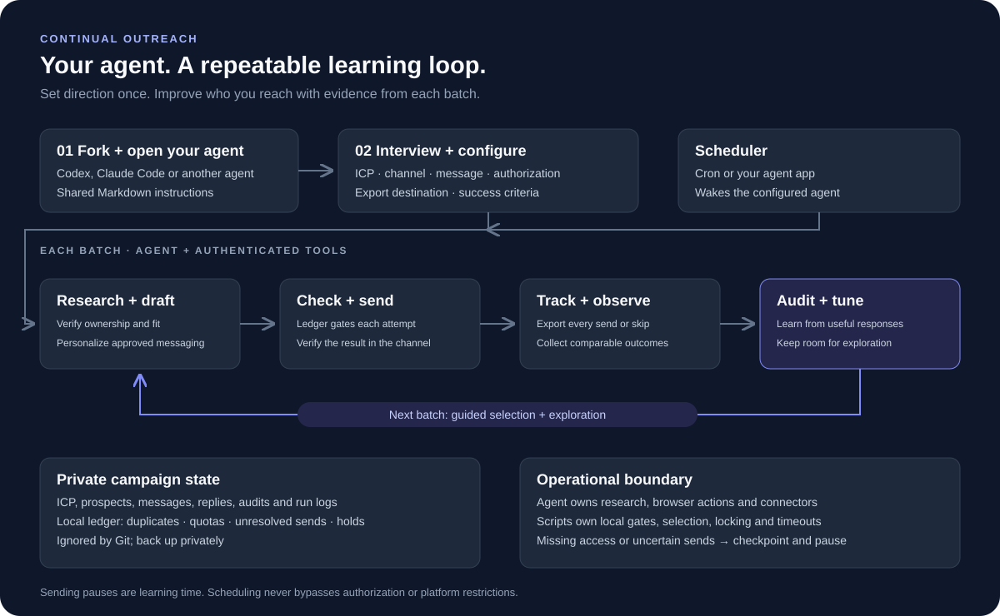

<h1 align="center">Continual Outreach</h1>

<p align="center">
  
  
  
  <a href="https://x.com/kunggaochicken"></a>
</p>

<p align="center"><strong>Bring your agent. Find your customers. Learn from every batch.</strong></p>

<p align="center">
  <a href="assets/walkthrough.mp4"></a>
</p>
<p align="center"><strong><a href="assets/walkthrough.mp4">Open video with pause and scrub controls</a></strong><br>
<sub>Mock Codex-style workspace. Fictional people and data; no real outreach.</sub></p>

**The example:** a founder building a support documentation tool wants 15-minute
interviews with support operations leads at B2B SaaS companies who personally review
recurring tickets and update help articles every week. The agent turns that brief into
qualification criteria, researches candidates on the internet, verifies a LinkedIn profile and prepares
an approved, specific invitation.


A **specialized continual-outreach agent**, packaged as a portable distro of instructions,
skills and scripts. Run it with Codex, Claude Code or your preferred agent. Tell it what
you want to learn; it handles campaign formulation, research, outreach and feedback.

Start with a hypothetical idea or an existing product. Add GitHub repos, local codebases,
documents or interview notes when useful. You choose the context; the agent never assumes
that the codebase where it is running is the product you want to market.

Between batches, it uses useful responses to refine the next set of profiles while
preserving room to explore. The repository supplies shared instructions, campaign state
and reliable scheduling scripts. You supply the agent and its authenticated tools.

<p align="center">
  <a href="#start">Start</a> ·
  <a href="#architecture">Architecture</a> ·
  <a href="#the-feedback-loop">Feedback loop</a> ·
  <a href="docs/scheduling.md">Scheduling</a> ·
  <a href="docs/exports.md">Exports</a>
</p>

## Start

Clone or fork the repo, open your preferred agent in it, and say:

> Help me figure out who to reach out to for my product idea.

Or bring context:

> I’m exploring a product for support teams. Use this GitHub repo and these interview
> notes to help sharpen the ICP, then find people I can learn from.

That is the front door. The agent asks about your goal, offers useful starting directions
and handles its internal skills, campaign files and optional scheduling. There is no
mandatory codebase selection or setup questionnaire.

**Already working in another workspace?** Tell your agent to read this clone's
`OUTREACH.md`. It takes on the same outreach role while preserving that workspace's
instructions. [Optional workspace integration](docs/portable.md) makes it discoverable
in later sessions; it is not required to begin.

The agent helps you define:

| Decision | What you work out together |
| --- | --- |
| Ideal customers | Product, painful workflow, ownership evidence and disqualifiers |
| Outreach | Channel, account, existing contacts, authorization and sending budget |
| Messaging | Your voice, verified work references and call to action |
| Tracking | Google Sheets, local CSV or another available export connector |
| Learning | What counts as a useful response, observation window and exploration budget |

Once your ICP and messaging direction are clear, the agent opens its own supported
computer-use browser session and researches the web to find leads. It follows sources, verifies who
actually owns the relevant work, saves a private campaign and shows personalized drafts.
It also checks export access. Sending begins only within your authorization; that authorization carries
forward within its scope.

**No specific agent runtime is required.** [OUTREACH.md](OUTREACH.md) is the portable
entrypoint. In the distro itself, [AGENTS.md](AGENTS.md) and [CLAUDE.md](CLAUDE.md) route
to it. Every instruction is ordinary Markdown, so agents without skill discovery can
read the same workflow directly.

## Architecture



Computer use is the default: the current agent navigates the web to research prospects,
verify their work and interact with the chosen channel. Search tools and export connectors
complement that browser workflow. Local scripts keep state and enforce operational gates. A scheduler wakes the agent; it does not send
messages itself. During sending pauses, the agent audits outcomes and prepares the next
batch.

| Component | Responsibility |
| --- | --- |
| Agent instructions | Interview, research, qualification, messaging and recovery |
| Your agent and tools | Web research, supported computer use and export connectors |
| Campaign ledger | Duplicate protection, reservations, send caps and audit holds |
| Selection planner | Rank qualified segments using observed outcomes and exploration |
| Scheduled runner | Deliver prompts, serialize local runs, enforce timeouts and save logs |
| Private campaign and exports | Preserve prospects, exact messages, outcomes and policy changes |

## The feedback loop

**Research → qualify → personalize → send → observe → audit → tune.**

Success means a useful response defined during onboarding. Acceptance, relevant replies,
booked conversations and substantive feedback remain separate outcomes, so optimizing
for connections does not silently replace learning from customers.

The initial policy uses **80% posterior-guided selection and 20% exploration** among
qualified profiles. [The planner](scripts/select_batch.py) uses segment-level Thompson
sampling with Beta posteriors. It learns only from comparable, fully observed windows;
recent and unknown outcomes remain unobserved rather than becoming failures.

The agent interprets conversation feedback, researches similar profiles and records
selection changes. This is a delayed-feedback bandit approximation, not a trained model
over individual prospects. The planner proposes a batch; authorization and send gates
still decide whether it can run.

## Scheduling

Tell your agent:

> Keep this campaign running. Set up the schedule for me.

The agent discovers its runtime, checks the tools available to scheduled sessions and
sets up the appropriate scheduler. It reuses an existing schedule or configures its own
launch command, writes the private runner configuration and verifies setup. You choose
the cadence; **you do not need to assemble commands or edit configuration files**.

When available, an app scheduler can retain the current session's tools. For CLI-based
scheduling, the included runner supplies prompts, serializes local runs, saves logs and
enforces timeouts. Failed runs are not automatically retried.

If authentication or a required tool is missing, the agent asks for that specific step.
See [Scheduling](docs/scheduling.md) for the agent setup procedure and manual reference.

## Capabilities and limits

- **The agent handles browser startup.** It discovers and starts the computer-use tools
  in its environment. If access or login is missing, it asks for that specific step and
  continues any available read-only research. Cloning the repo does not install a browser
  integration.
- **Channel support is explicit.** The included send guard supports LinkedIn profile
  identity. Other channels can be researched and drafted, but need a tested identity
  adapter before automated sending.
- **Pacing is not platform permission.** LinkedIn prohibits third-party automated
  activity. Use manual sending when appropriate and stop on platform warnings.
- **Scheduled access can differ.** A cron-launched CLI may lack desktop browser tools.
  The POSIX runner supports Linux/macOS; unavailable capabilities produce a checkpoint.
- **Local locks are local.** Reconcile account-wide sends and serialize senders across
  campaigns and machines. An uncertain send stops further sending until reconciled.

## Private state and tracking

Portable campaigns keep configuration, prospects, messages, replies, audits and run logs
outside the product workspace, by default under `~/.local/share/continual-outreach/`.
Standalone campaigns can use ignored `campaigns/` in the distro. Keep a private backup:
these records are not included in your fork.
The repository contains only a [generic, draft-mode example](examples/campaign.json).

Exports use stable IDs and are verified after each send or skip. If synchronization
fails, sending pauses until the tracker is repaired. See [Exports](docs/exports.md).

```sh
# Inspect your campaign
python3 scripts/campaign.py --campaign campaigns/my-campaign status

# Run the offline checks; no real outreach is sent
python3 -m unittest discover -s tests -v
```

---

[Portable entrypoint](OUTREACH.md) · [Outreach skill](.agents/skills/outreach/SKILL.md) ·
[Scheduling](docs/scheduling.md) · [Exports](docs/exports.md)
