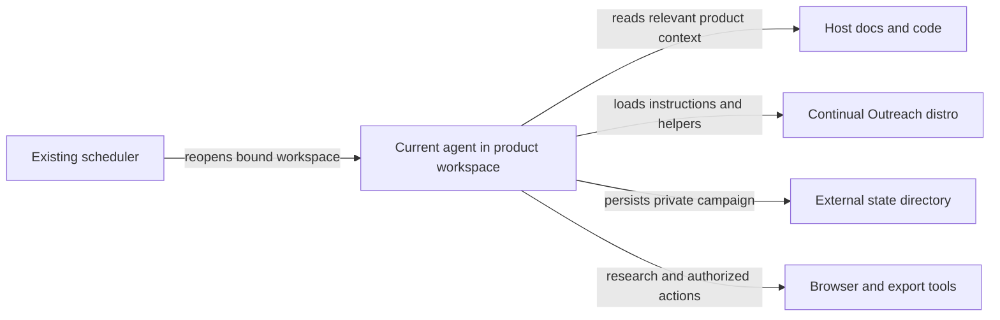

# A distro you can use inside another workspace

Continual Outreach is a portable directory of agent instructions, skills, tools and
state conventions, inspired by [Firstmate](https://github.com/kunchenguid/firstmate).
The source checkout is the distro. Agents use it from their current product workspace;
cloning it does not require moving your coding session into it.

## Optional: use it from your current workspace

> Load /absolute/path/to/continual-outreach/OUTREACH.md and help me start an outreach campaign.

The specialized agent handles its internal skills and setup. It offers broad starting
suggestions when your intent is unclear. You may choose multiple GitHub repositories,
local projects, documents or interview notes as context, or use no sources at all. For example:

> I’m considering a new product for independent designers. Help me explore the ICP.

Or explicitly bring in the workspace:

> Use this codebase to supplement my product brief and propose an ICP.

That works with any agent able to read local files. It needs no installer, change to
host instructions, new runtime or browser setup until browser work is required.

For discovery in later sessions, ask the agent:

> Install the continual-outreach workspace skill here, preserving existing instructions.

The agent runs this from the product workspace (substituting the real distro path):

```sh
python3 /absolute/path/to/continual-outreach/scripts/workspace.py install --workspace "$PWD"
```

It creates small loaders under `.agents/skills/continual-outreach/` and
`.claude/skills/continual-outreach/`. Neither host `AGENTS.md` nor `CLAUDE.md` is touched.
If another file already occupies a loader path, installation refuses to overwrite it.
Re-running the same installation is harmless. Loaders contain machine-local absolute
paths: keep them local unless deliberately sharing them; they are not portable commits.
If your agent does not discover skills, tell it to read either loader directly.

## Context, state and ownership



On invocation, the agent offers to explore a new or hypothetical idea, shape a campaign
from an existing product brief, or continue a campaign. It offers codebase context as an
optional supplement and reads it only when you choose it. Your selected idea or product
defines the campaign; the current working directory does not. With codebase context
selected, the agent proposes users and workflows from evidence and asks about gaps. It records internal observations
separately from approved public claims. It does not send private source or roadmap
content to prospect research, outreach or shared trackers.

The agent initializes private state with:

```sh
python3 /absolute/path/to/continual-outreach/scripts/workspace.py init \
  --workspace "$PWD" --name customer-discovery
```

The result identifies the campaign's absolute path, normally under
`~/.local/share/continual-outreach/workspaces/<workspace-id>/campaigns/<name>/`.
`--state-home` selects another private directory outside the product workspace and distro.
Same workspace/name resumes the same state; distinct workspaces do not silently share
campaigns. New campaigns start paused and unauthorized. Never infer a zero-send account
from a new ledger: reconcile the whole account before any outreach.

Reuse the returned path for helpers, for example:

```sh
python3 /absolute/path/to/continual-outreach/scripts/campaign.py \
  --campaign /absolute/private/campaign/path status
```

`workspace.json` binds the campaign to its execution workspace and distro, not to an
assumed product. The checkpoint records the selected idea and opt-in context sources. The runner uses
it to restore context in scheduled sessions. Reuse an explicitly selected campaign across
agents; never create another ledger or scheduler merely to switch agents. To move a
campaign to another workspace, the agent must review context, authorization and scheduler
paths before updating the binding. Do not blindly reuse an ICP for a different product.

## Portability boundaries

- The distro works from any local directory. Workspace skill discovery depends on the
  agent; reading OUTREACH.md is the universal fallback.
- Browser tools, authentication, connectors and an agent runtime come from the host.
- Private state can be backed up or moved separately. Moving to another machine requires
  updating absolute bindings/loaders and revalidating tools and scheduler access.
- Installer files are only small loaders; the distro must remain available at its path.
  Upgrading the distro updates the shared workflow. Existing private state is preserved.
- The local lock coordinates one distro checkout, not multiple machines. Keep one sender
  per account, including other campaigns and manual outreach.

Standalone use from the distro checkout still works. Existing campaigns and automations
are not migrated by installing a loader or initializing a new portable campaign.
